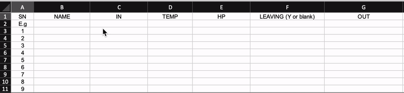

# excel-contact-sheet
Contact sheet for people who want a slightly less manual way to record visitors, and do not have the infra or technology to do automated contact tracing.

I've written a simple formula to automatically fill up the datetime columns when a name is added to a list, or when the said name has left the premises. 

Please use responsibly. 

Example Usage:

### Prerequisites
1. You need to have MS Excel on your computer/ laptop/ device

2. Enable "Use Iterative Calculation" / "Enable iterative calculation". 

	- Windows Users : File > Options > Formulas > ensure "Enable iterative calculation" is checked
	- Mac Users : Excel > Preferences > Calculation > ensure "Use iterative calculation" is checked

3. I guess a hand held IR Thermometer or scanner

### How to get this document

##### Non-git user:

1. If you are unfamiliar with git, you can click on the green button on the top right corner to download the contact trace document. It will be downloaded to your computer in a zip file. 

2. Unzip the file and use the document.

##### Git User

1. Clone the repo

2. File will be available for use.